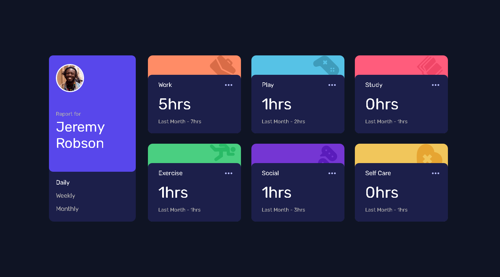
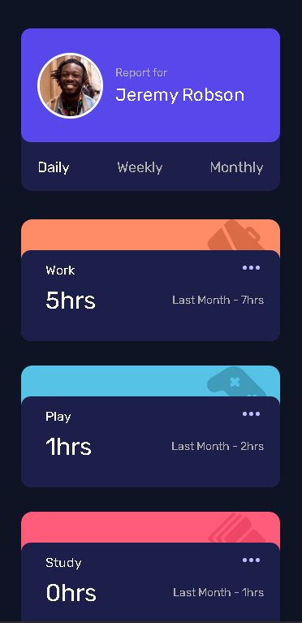
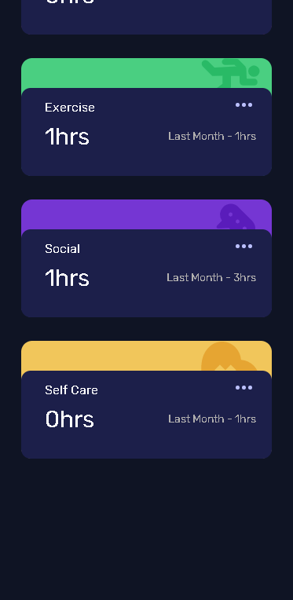

# Time-tracking-dashboard

# Frontend Mentor - Time tracking dashboard solution

This is a solution to the [Time tracking dashboard challenge on Frontend Mentor](https://www.frontendmentor.io/challenges/time-tracking-dashboard-UIQ7167Jw). Frontend Mentor challenges help you improve your coding skills by building realistic projects. 

## Table of contents

- [Overview](#overview)
  - [The challenge](#the-challenge)
  - [Screenshot](#screenshot)
  - [Links](#links)
- [My process](#my-process)
  - [Built with](#built-with)
  - [What I learned](#what-i-learned)
  - [Continued development](#continued-development)
  - [Useful resources](#useful-resources)
- [Author](#author)


## Overview

### The challenge

Users should be able to:

- View the optimal layout for the site depending on their device's screen size
- See hover states for all interactive elements on the page
- Switch between viewing Daily, Weekly, and Monthly stats

### Screenshot






### Links

- Live Site URL: [https://time-tracking-dashboard-3c05f.web.app/](https://time-tracking-dashboard-3c05f.web.app/)

## My process

### Built with

- Semantic HTML5 markup
- CSS custom properties
- Flexbox
- CSS Grid
- Vanilla JavaScript


### What I learned

In this challange, i used fetch api and get data from json file. I get the data and reflect to the page with for loop and DOM manipulation.

```js
fetch("data.json") // Get data from json file
.then(function(response){
  return response.json();
})
.then(function(products){ // After getting data from json
  for(let i = 0; i < products.length;i++){ // Looping through json file and assigning its data to variables.(Default)
}
```

### Continued development

This was the first time i used such a long media query. I'm trying to get better at responsive design. After this challenge, i will start to learn bootsrap and focus on responsive design even more. Also i failed to do all design with only grid. I used flexbox for the left column. I will be working on my grid skills.

I will continue to learn new things in JS and practice my algorithm skills.

### Useful resources

- [mdn](https://developer.mozilla.org/en-US/docs/Web/API/Fetch_API/Using_Fetch) - This helped me with using the Fetch api.
- [Youtube](https://www.youtube.com/watch?v=eS-FVnhjvEQ&list=WL&index=1) - This helped me with displaying JSON data.
## Author


- Frontend Mentor - [@Mustafacmn](https://www.frontendmentor.io/home)
- Twitter - [@beginnercoder](https://twitter.com/beginnercoderr)


